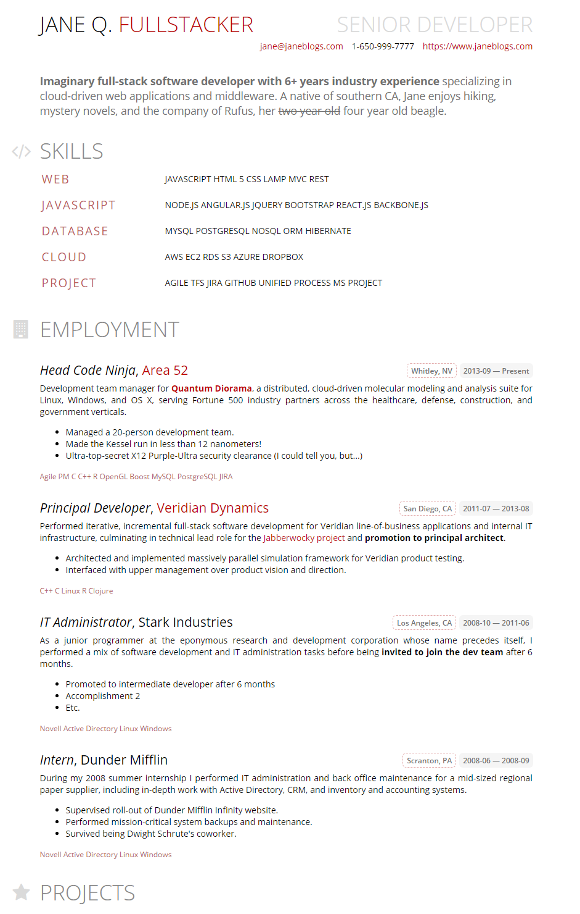

fresh-theme-positive
===
*A dynamic two-color [FRESH][f] résumé theme for technical professionals.*

## Instructions

1. Install [HackMyResume][hmr].

2. This theme currently comes pre-installed with HackMyResume as part of the
[fresh-themes repository][ftr], so you don't need to install it explicitly. But
you could, with `npm i fresh-theme-positive`.

3. Run `hackmyresume build my-resume.json out/output.all -t positive`.

## Screenshot

## License

MIT. See [LICENSE.md][lic] for details.

[hmr]: https://github.com/hacksalot/HackMyResume
[ftr]: https://github.com/fresh-standard/fresh-themes
[lic]: LICENSE.md
[f]: https://resume.freshstandard.org
